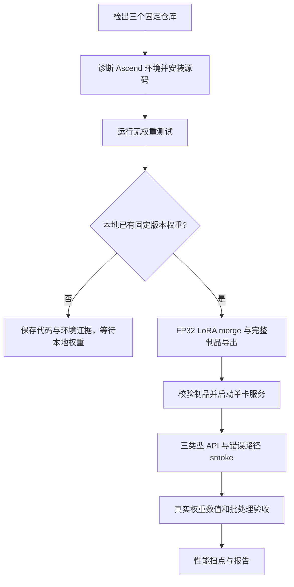

# KEV Qwen3 Ascend 远端执行手册

本文针对远端 Ascend Linux 容器，按代码检出、环境诊断、无权重测试、离线 LoRA
merge、服务启动和验收的顺序执行。仓库分支为 `kevvllmascendgp`。本文不会下载模型
或权重；模型源文件须事先放在远端本地目录。

当前状态：导出器和 CPU 单元测试已验证；Ascend dummy、完整真实权重、精度、并发
和性能仍待远端执行。CANN 9.0.1 与当前 vLLM-Ascend 0.26 安装文档中的 CANN 9.1.0
配套版本不同，应保存实际运行结果，不预先认定兼容。



## 0. 约定本地路径

先在已经配置好 CANN 和 torch-npu 的容器内执行。调整以下路径以匹配远端实际挂载；
后续命令在 `kev-va-run` 根目录执行。`KEV_CHECKPOINT` 与 `KEV_BASE` 是已经存在的
本地模型目录，不是下载地址。

```bash
export KEV_CHECKPOINT=/models/source/kev-4b-qwen3
export KEV_BASE=/models/source/Qwen3-4B-Base
export KEV_ARTIFACT=/models/serving/kev-qwen3-4b
export KEV_RESULTS=/data/kev/results

mkdir -p "$KEV_RESULTS"
```

若当前没有本地权重，可先执行第 1–3 步，然后在第 4 步停止。不要为通过制品检查
而改动来源 SHA 或手工伪造模型目录。

## 1. 检出固定代码

在希望存放工作区的目录执行：

```bash
git clone -b kevvllmascendgp \
  https://github.com/kelinbruce/kev-va.git kev-va-run
cd kev-va-run

git submodule init
git config submodule.vllm-upstream.url \
  https://github.com/kelinbruce/vllm.git
git submodule update --recursive

git rev-parse HEAD
git -C vllm-upstream rev-parse HEAD
git -C vllm-ascend rev-parse HEAD
```

根仓库实施基线是 `3ed578676175b1ea078c05a811e9d8be3a5b820b`；本手册提交后
根仓库 HEAD 会是其后续提交。vLLM 与 vLLM-Ascend 子仓库的预期提交依次为：

```text
dc7f73910b48c0d7ba2446bfcc3a1168fe716005
0553039e12b671e37de5fbce414dd6a4503a3405
```

根仓库 `.gitmodules` 中的 vLLM URL 是官方上游；上面的本地 URL 覆盖用于获取
fork 中的固定实施提交。检出的 vLLM 已包含 KEV 代码，**不要再次应用**
`evidence/patches/vllm-kev-qwen3-v0.26.0.patch`。

## 2. 诊断环境并安装源码

以下命令须在**实际运行容器**和准备使用的 Python 环境中执行。先记录硬件、CANN、
PyTorch 与 torch-npu：

```bash
npu-smi info
cat /usr/local/Ascend/ascend-toolkit/latest/version.cfg

python - <<'PY'
import torch
import torch_npu

print("torch:", torch.__version__)
print("torch_npu:", torch_npu.__version__)
PY
```

还需保存驱动、固件、NNAL、Triton Ascend、容器镜像 digest 和上述三个 commit。
如果容器已具备匹配 vLLM 0.26 的 Python 依赖，可在**同一个已激活的环境**中将固定
源码安装为 editable 包。`--no-deps` 保留容器已有的 torch/torch-npu 版本：

```bash
VLLM_TARGET_DEVICE=empty uv pip install --no-deps -e ./vllm-upstream
uv pip install --no-deps -e ./vllm-ascend
uv pip check

python - <<'PY'
import vllm
import vllm_ascend

print("vllm:", vllm.__file__)
print("vllm_ascend:", vllm_ascend.__file__)
PY
```

两个 import 路径应解析到本次安装的代码。如果容器没有 `uv`、缺少构建依赖，或
`uv pip check` 报出版本冲突，先记录错误并按
[`vllm-ascend/docs/source/installation.md`](../vllm-ascend/docs/source/installation.md)
处理匹配环境；不要仅为绕过错误而替换 CANN 或 torch-npu。

## 3. 运行无权重测试

根仓库工具测试：

```bash
python -m pytest -q \
  tests/test_kev_artifact.py \
  tests/test_kev_benchmark.py
```

上游 vLLM 的相关测试：

```bash
cd vllm-upstream
python -m pytest -q \
  tests/models/test_kev_qwen3.py \
  tests/model_executor/layers/test_kev_pooler.py \
  tests/entrypoints/pooling/systemone
cd ..
```

本地开发机上游测试收集曾受可选 `llguidance`、`xgrammar` 依赖缺失影响。远端若遇到
同类问题，应记录缺失依赖和测试日志；不要把收集失败记为 NPU 推理失败。CPU 测试
通过也不代表 Ascend dummy 路径通过：后者仍需在实际设备上单独执行并保存日志。

## 4. 核对来源并在导出时完成 LoRA merge

固定来源为 `jaredpalmer/kev-4b@c4bfa11b0dc07691884f2d97f1c4c4c05c92e416`
与 `Qwen/Qwen3-4B-Base@906bfd4b4dc7f14ee4320094d8b41684abff8539`。
先检查本地必需文件：

```bash
test -f "$KEV_CHECKPOINT/adapter_config.json"
test -f "$KEV_CHECKPOINT/adapter_model.safetensors"
test -f "$KEV_CHECKPOINT/head.pt"
test -f "$KEV_CHECKPOINT/tokenizer.json"
test -f "$KEV_BASE/config.json"
test -f "$KEV_BASE/model.safetensors.index.json" || \
  test -f "$KEV_BASE/model.safetensors"
```

在独立导出环境运行下列命令。`export` 在读取每个 LoRA 目标权重时计算
`W + (alpha / rank) × B × A`，在 FP32 中完成 merge；随后将 backbone 转为明确
指定的 BF16，同时将 pointer head 的 weight/bias 保持 FP32。merge **没有第二条独立
命令**。

```bash
python tools/kev_artifact.py export \
  --source "$KEV_CHECKPOINT" \
  --base "$KEV_BASE" \
  --provenance evidence/sources/qwen3-checkpoint.json \
  --output "$KEV_ARTIFACT" \
  --model-id kev-qwen3-4b \
  --dtype bfloat16 \
  --max-branch-tokens 8192

python tools/kev_artifact.py validate "$KEV_ARTIFACT"
```

导出器会校验来源文件 SHA256、架构、LoRA 目标、head 参数、结构 token、所有输出
文件校验值，并写入 `kev_manifest.json`。目标目录已存在时默认拒绝覆盖；请先选择
新的输出目录，不要直接用 `--force` 替换正在服务的制品。

## 5. 启动单卡决策服务

回到运行环境，在第一个终端执行。若导出环境与服务环境不同，先把完整制品目录
挂载到服务容器的 `KEV_ARTIFACT` 路径，再运行 `validate`。

```bash
vllm serve "$KEV_ARTIFACT" \
  --served-model-name kev-qwen3-4b \
  --runner pooling \
  --tensor-parallel-size 1 \
  --dtype bfloat16 \
  --enforce-eager \
  --no-enable-prefix-caching \
  --no-enable-chunked-prefill \
  --max-model-len 8192 \
  --max-num-seqs 16 \
  --max-num-batched-tokens 8192 \
  --port 8000
```

首版只验证单卡、显式 dtype、eager。不要开启量化、运行时 LoRA、图执行、APC 或
chunked prefill。服务启动时还会校验制品、已加载配置/tokenizer，并进行一条有效
决策 warm-up。HTTP 进程存在但 `/v1/systemone` 返回 `503 model_not_ready` 时，
仍须检查服务日志并视作未就绪。

## 6. 功能 smoke 与指标

在第二个终端进入工作区，重新设置第 0 步的路径环境变量（若需要），发送同时包含
`noul`、`choice` 和 `score` 的请求：

```bash
curl -sS -i http://127.0.0.1:8000/v1/systemone \
  -H 'Content-Type: application/json' \
  -d '{
    "model": "kev-qwen3-4b",
    "state": {"customer": "企业客户", "days_overdue": 12},
    "questions": {
      "renew": {
        "type": "noul",
        "instructions": "是否优先续约跟进"
      },
      "owner": {
        "type": "choice",
        "instructions": "选择跟进团队",
        "criteria": {"sales": "销售团队", "success": "客户成功团队"}
      },
      "risk": {
        "type": "score",
        "instructions": "评估流失风险",
        "criteria": ["低", "中", "高"]
      }
    }
  }'
```

通过条件：HTTP 200、三题均有答案、概率合法，且 `usage`、`latency_ms` 存在。
读取指标，并验证 KEV 专用实例不提供生成接口：

```bash
curl -sS http://127.0.0.1:8000/metrics

curl -sS -i http://127.0.0.1:8000/v1/chat/completions \
  -H 'Content-Type: application/json' \
  -d '{"model":"kev-qwen3-4b","messages":[{"role":"user","content":"hi"}]}'
```

还需保存输入限额、未知模型、超时、断连、分支失败和恢复请求的日志；一次 smoke 成功
不等于这些生命周期场景已通过。

## 7. 数值与批处理验收

准备至少 200 个冻结问题，三类型各不少于 30 个，另备边界集；保存数据 SHA256、
参考原始概率/logits、token IDs 和 readout 位置。先在参考环境验证 FP32 merge
前后最大概率绝对误差 `<=1e-4`，再以同 dtype 的参考结果比较 NPU：

- 每题每选项平均绝对误差的总体平均 `<=0.002`；最大绝对误差 `<=0.02`。
- argmax 一致率 `>=99%`；参考 top1/top2 差值 `>0.04` 的题目须全部一致。
- 单题/批量/问题重排/跨请求混排的最大概率差 `<=0.005`。
- 另记 0.5/0.8/0.9 阈值动作、Brier/ECE、中文与长上下文表现。

**当前交付缺口：** `/v1/systemone` 为兼容 KEV 协议把概率舍入为两位小数，不能
用 HTTP 响应直接计算上述原始概率阈值。当前分支也没有完整的参考集生成、NPU 原始
概率导出与自动比较脚本。该阶段须先补齐内部诊断和对比入口，不能把第 6 步 smoke
或两位小数响应记为精度通过。验收目标及数据路径见
[`configs/kev_real_weight_acceptance.json`](../configs/kev_real_weight_acceptance.json)。

## 8. 性能扫点

先查看基线、单因素和多因素组合：

```bash
python tools/kev_benchmark.py plan
```

准备 `/data/kev/verified-state-workloads.json`，格式如下；其中 `state` 必须是
用固定 tokenizer **实际核验**为相应 token 数的内容，不能直接使用示例文字：

```json
[
  {"state_tokens": 128, "state": "已核验的 128-token 内容"},
  {"state_tokens": 1024, "state": "已核验的 1024-token 内容"},
  {"state_tokens": 4096, "state": "已核验的 4096-token 内容"}
]
```

例如运行基线 case：

```bash
python tools/kev_benchmark.py run \
  --case s128-q1-k2-c1 \
  --states /data/kev/verified-state-workloads.json \
  --output "$KEV_RESULTS/s128-q1-k2-c1.json"
```

对 `plan` 中其余 case 分别运行并归档 JSON。脚本记录 warm-up、样本数、P50/P95、
请求/问题吞吐、`/metrics` 的实际输入 tokens/s 和失败数。峰值 NPU 显存须同时从
Ascend 运行时采集；脚本未采集时会在结果中显式标为缺失。只有满足 token 限额的
组合才能纳入正式报告。

## 9. 结论与停止条件

| 到达阶段 | 可以得出的结论 | 尚不能得出的结论 |
|---|---|---|
| 1–3 | 代码版本、环境与单元测试状态 | NPU 执行或真实模型可用 |
| 4 | 本地模型可导出，LoRA 已合并且制品结构完整 | merge 前后全模型概率一致 |
| 5–6 | 单卡服务与三类型 API 可执行 | 原始概率精度、并发恢复和性能已达标 |
| 7–8 | 需以真实数据和完整报告逐项判定 | 不得由启动或 dummy 成功自动推定 |

若任何阶段失败，保存所用 commit、镜像/依赖版本、输入、完整日志与错误码，停在该
阶段定位。实际环境与验收状态继续更新在
[`evidence/task_8_4_status_matrix.md`](../evidence/task_8_4_status_matrix.md)。
